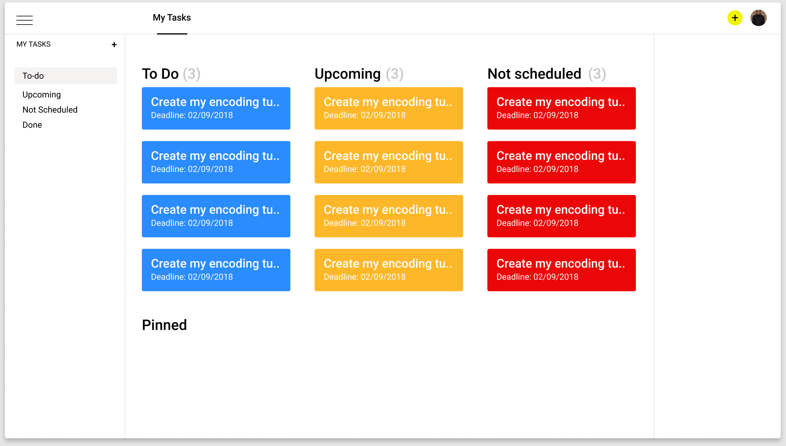

# Node + Vue.js + PostgreSQL


> A minimal todo app showcasing the synergy between the frontend masterpiece - Vue and Node.

## Functionalities
* Single Page
* User Accounts
* Authentication with Passport.js
* MVC with Sequelize ORM

## Build Setup

``` bash
# install dependencies
npm install

# serve with hot reload at localhost:8080
npm run dev

# build for production with minification
npm run build
```